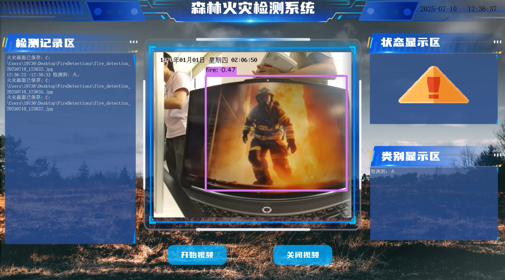
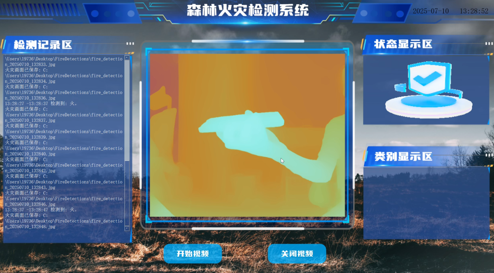
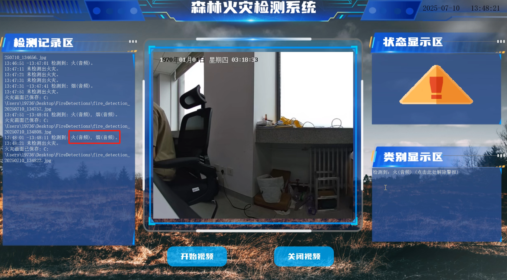

# 智能火灾监测系统

## 项目背景

传统非接触式火灾监测系统普遍存在检测效率低、覆盖范围小等问题，而现有视觉检测系统易受云雾、工业排烟等环境干扰，导致误判和漏检频发。因此，本研究针对传统工业火灾监测系统存在的响应延迟、误报率高及环境适应性差等问题，提出了一种基于边缘计算的智能火灾监测系统。该系统融合多模态传感技术与深度学习算法，显著提升了火灾检测的准确性和实时性，为工业防火提供了可靠的技术解决方案。

## 主要创新点

1. **高精度抗干扰检测模型**  
   基于改进YOLOv8算法，结合渐进特征金字塔网络（AFPN）和轻量化非对称检测头（LADH），采用WIoUv3损失函数优化，在自制数据集上实现92.1%的检测准确率。

2. **多模态报警机制**  
   集成Vosk语音识别引擎（准确率>90%），构建视觉-听觉双通道报警系统。当检测到“着火”等关键词时自动触发报警，形成多维度的应急响应闭环。

3. **三维精确定位功能**  
   搭载DepthAnything深度估计模型，可实时计算火源的距离和空间位置，定位精度达±0.5m，为灭火救援提供关键的空间信息。

4. **高效边缘计算架构**  
   将检测任务部署在龙芯2K1000LA边缘计算单元，从而实现实时响应。采用广和通L610-CN 4G模块确保数据传输的可靠性，TCP协议保障信息完整有序。

5. **智能化交互界面**  
   设计简洁直观的操作平台，支持用户账号管理、实时监测和报警记录等功能，显著提升用户体验和操作效率。

## 系统设计

系统采用模块化设计，核心硬件包括龙芯2K1000LA处理器、海康威视工业摄像头和多功能供电模块，集成于防尘防水铝合金机箱内，可在-20℃~60℃环境下稳定工作，无外部供电时可持续工作8小时以上。

## 应用前景

本系统的推广应用将有效提升工业火灾预警能力，减少因火灾造成的碳排放和经济损失，为工业安全生产和环境保护提供重要技术支撑。

## 关键词

火灾目标检测；渐进特征金字塔网络；三维定位；语音识别

# 1.1 边缘计算与火灾监测系统

## 1 边缘计算与数据传输

龙芯 2K1000LA 边缘计算单元实现本地化 AI 推理，支持动态降频降压以适配实时性需求，降低数据传输延迟。火灾目标检测后的画面如图1所示。采用 TCP 协议通过双频路由器（支持 2.4GHz/5GHz Wi-Fi 及 4G 扩展）传输检测结果（图像、坐标、音频），确保数据可靠同步。

*图1：边缘计算结果图*

## 2 火灾三维定位与深度估计

集成 DepthAnything 单目深度估计算法，用户可通过交互界面触发深度图生成或目标中心点深度计算，为火情定位提供空间坐标参考（绝对相对误差低至 0.045）。单目深度估计结果图如图2所示。

*图2：单目深度估计结果图*

## 3 多模态报警与交互

结合视觉报警（界面警告动图）、音频报警（实时语音识别触发，基于 Vosk 模型，识别准确率 90% 以上，语音识别报警如图3所示）及历史记录存储，实现多维度警示。基于 PyQt5 的交互界面支持登录验证、实时监控、深度信息查看及操作记录回溯，操作直观便捷。

*图3：语音识别报警结果图*
